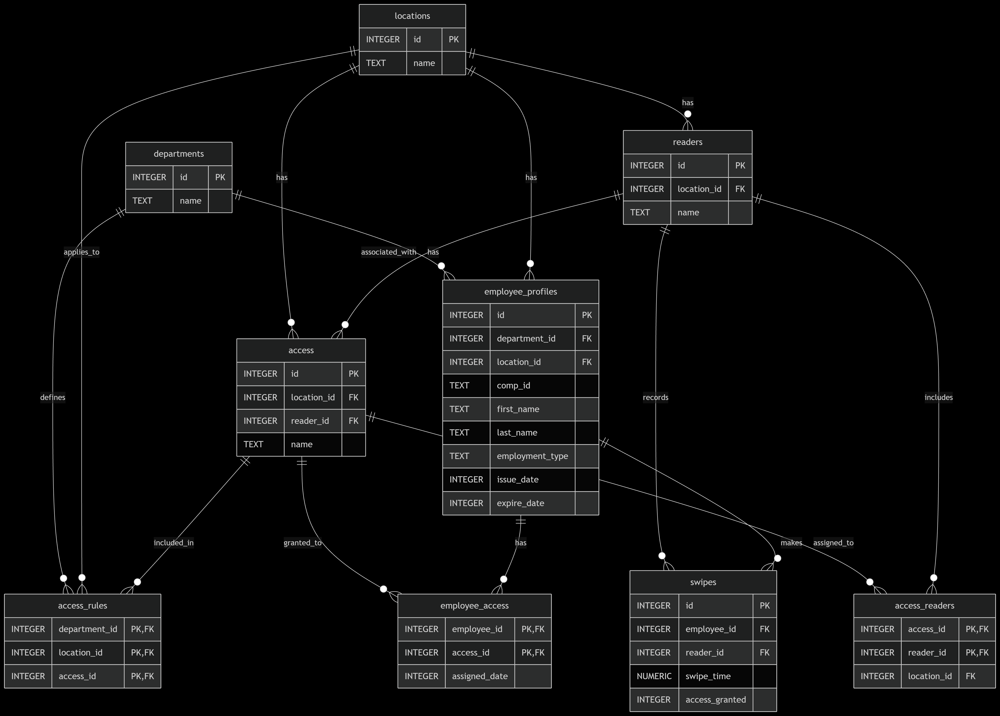

# Design Document

`access_control.db`

By Vladimir Vukojičić

Video overview: ([https://www.youtube.com/watch?v=h3H3I_UrFZM])

## Scope

This database manages access control systems for a multi-location organization. Included in scope are:

* Departments within the organization
* Physical locations/sites
* Access control devices (readers) at each location
* Access profiles defining clearance levels
* Employee badge information and profiles
* Access rules linking departments to access profiles
* Swipe event tracking with access grant status

Out of scope are: detailed building maps, network infrastructure details, visitor management systems, and badge printing logistics.

## Functional Requirements

This database will support:

* CRUD operations for departments, locations, and readers
* Management of access profiles and their associations with readers
* Employee onboarding with automatic access profile assignment
* Real-time swipe event recording with access validation
* Automated employee ID generation and maintenance
* Access rule management by department/location
* Employee access auditing through materialized views

## Representation

Entities are captured in SQLite tables with the following schema.

### Entities

The database includes the following entities:

#### Departments

The `departments` table includes:

* `id`, which specifies the unique ID for the department as an `INTEGER`. This column thus has the `PRIMARY KEY` constraint applied.
* `name`, which specifies the department's name as `TEXT`, given `TEXT` with constrained values `NOT NULL`, `HR`, `Finance`, `ITS`, `Sales`, `Support`.

#### Locations

The `locations` table includes:

* `id`, which specifies the unique ID for the location as an `INTEGER`. This column thus has the `PRIMARY KEY` constraint applied.
* `name`, which specifies the location name as `TEXT` with constrained values `NOT NULL`, `Belgrade, RS`, `Boston, MA`, `Jakarta, ID`, `Melbourne, AU`, `Santiago, CL`.

#### Readers

The `readers` table includes:

* `id`, which specifies the unique ID for the reader as an `INTEGER`. This column thus has the `PRIMARY KEY` constraint applied.
* `location_id`, which is the ID of the associated location as an `INTEGER`. This column thus has the `FOREIGN KEY` constraint applied, referencing the `id` column in the `locations` table to ensure data integrity.
* `name`, which is the name of the reader set as `TEXT` with constrained values `NOT NULL`. No other constraints are necessary.

#### Access

The `access` table includes:

* `id`, which specifies the unique ID for the access(clearance) as an `INTEGER`. This column thus has the `PRIMARY KEY` constraint applied.
* `location_id`, which is the ID of the location as an `INTEGER`. This column thus has the `FOREIGN KEY` constraint applied, referencing the `id` column in the `locations` table to ensure data integrity.
* `reader_id`, which is the ID of the reader as an `INTEGER`. This column thus has the `FOREIGN KEY` constraint applied, referencing the `id` column in the `readers` table to ensure data integrity.
* `name`, which is the name of the access set as `TEXT` with constrained values `NOT NULL` and `UNIQUE`. No other constraints are necessary.

#### Access Readers (Junction Table)

The `access_readers` table includes:

* `access_id`, which is the ID of the access(clearance) as an `INTEGER`. This column thus has the `FOREIGN KEY`, `ON DELETE CASCADE` constraints applied, referencing the `id` column in the `access` table to ensure data integrity.
* `reader_id`, which is the ID of the reader as an `INTEGER`. This column thus has the `FOREIGN KEY`, `ON DELETE CASCADE` constraints applied, referencing the `id` column in the `readers` table to ensure data integrity.
* `location_id`, which is the ID of the location as an `INTEGER`. This column thus has the `FOREIGN KEY` constraint applied, referencing the `id` column in the `locations` table to ensure data integrity.
* Composite `PRIMARY KEY` from `access_id`'s and `reader_id`'s `FOREIGN KEY`.

#### Access Rules

The `access_rules` table includes:

* `department_id`, which is the ID of the department as an `INTEGER`. This column thus has the `FOREIGN KEY` constraint applied, referencing the `id` column in the `departmets` table to ensure data integrity.
* `location_id`, which is the ID of the location as an `INTEGER`. This column thus has the `FOREIGN KEY` constraint applied, referencing the `id` column in the `locations` table to ensure data integrity.
* `access_id`, which is the ID of the access(clearance) as an `INTEGER`. This column thus has the `FOREIGN KEY` constraint applied, referencing the `id` column in the `access` table to ensure data integrity.
* Composite `PRIMARY KEY` with `ON DELETE CASCADE` constraint across all three fields.

#### Employee Profiles

The `employee_profiles` table includes:

* `id`, which specifies the unique ID for the employee profile as an `INTEGER`. This column thus has the `PRIMARY KEY` constraint applied.
* `department_id`, which is the ID of the department as an `INTEGER`. This column thus have the `FOREIGN KEY`, `ON DELETE CASCADE` constraints applied, referencing the `id` column in the `departmets` table to ensure data integrity.
* `location_id`, which is the ID of the location as an `INTEGER`. This column thus has the `FOREIGN KEY`, `ON DELETE CASCADE` constraints applied, referencing the `id` column in the `locations` table to ensure data integrity.
* `comp_id`, which is generated employee ID set as `TEXT` with constrained values `NOT NULL` and `UNIQUE`.
* `first_name`, which specifies the employees's first name as `TEXT`, given `TEXT` is appropriate for name fields. With `NOT NULL` constraint.
* `last_name`, which specifies the employees's last name. `TEXT` is used for the same reason as `first_name`. With `NOT NULL` constraint.
* `employment_type`, which specifies the type of employment as `TEXT`, given `TEXT` is appropriate for employment type fields. With `NOT NULL`, `Contractor`, `Employee` constraint.
* `issue_date`, which is the date when employee profile was created as an `INTEGER` with constrained values `NOT NULL` and `DEFAULT (strftime('%Y%m%d', 'now'))`,.
* `expire_date`, which is the date set for a card to expire(contract exparation date) as an `INTEGER` with constrained values `NOT NULL`, `CHECK (expire_date > issue_date)`.

#### Employee Access

The `employee_access` table includes:

* `employee_id`, which is the ID of the employee profile as an `INTEGER`. This column thus has the `FOREIGN KEY`, `ON DELETE CASCADE` constraints applied, referencing the `id` column in the `departmets` table to ensure data integrity.
* `access_id`, which is the ID of the access(clearance) as an `INTEGER`. This column thus has the `FOREIGN KEY`, `ON DELETE CASCADE` constraints applied, referencing the `id` column in the `access` table to ensure data integrity.
* `assigned_date`, which is the date when access was assigned as an `INTEGER` with constrained value `DEFAULT (strftime('%Y%m%d', 'now'))`,
* Composite `PRIMARY KEY` from `employee_id`'s and `access_id`'s `FOREIGN KEY`.

#### Swipes

The `swipes` table includes:

* `id`, which specifies the unique ID for the card swipe as an `INTEGER`. This column thus has the `PRIMARY KEY` constraint applied.
* `employee_id`, which is the ID of the employee profile as an `INTEGER`. This column thus has the `FOREIGN KEY`, `ON DELETE CASCADE` constraints applied, referencing the `id` column in the `departmets` table to ensure data integrity.
* `reader_id`, which is the ID of the access(clearance) as an `INTEGER`. This column thus has the `FOREIGN KEY`, `ON DELETE CASCADE` constraints applied, referencing the `id` column in the `access` table to ensure data integrity.
* `swipe_time`, which is the date when employee used a card as `NUMERIC`, with constrained values `NOT NULL`,  `DEFAULT`, `CURRNUMERICENT_TIMESTAMP`.
* `access_granted`, which is the access outcome assigned as an `INTEGER` with constrained value `NOT NULL`,  `DEFAULT 0`, `CHECK("access_granted" IN (0, 1))`.

### Relationships

The below entity relationship diagram describes the relationships among the entities in the database.

As detailed by the diagram:

* Access Profiles ↔ Readers: Many-to-many relationship managed through access_readers junction table
* Departments-Locations-Access: Access rules define which access profiles are available to departments at specific locations
* Employees-Access: Employees gain access profiles through rules matching their department/location
* Readers-Swipes: Each swipe event occurs at a specific reader
* Locations-Readers: Readers belong to specific locations
* Employees-Swipes: All swipes are associated with an employee

## Optimizations

* Composite Indexes:
    `idx_readers_id_location` on `readers (id, location_id)`
    `idx_access_id_location` on `access (id, location_id)`
    `idx_access_rules_dept_loc` on `access_rules (department_id, location_id)`
* Performance Indexes:
    Expiration management: `idx_employee_expiration` on `employee_profiles(expire_date)`
    Swipe analysis:
        `idx_swipes_employee` on `swipes(employee_id)`
        `idx_swipes_time` on `swipes(swipe_time)`
        `idx_swipes_reader` on `swipes(reader_id)`

## Triggers

* Company ID Validation (`validate_comp_id`):
    Enforces format: `First Name Initial` + `Last Name Initial` + `6 digits`.
    Prevents invalid ID creation/updates.
* Access Assignment (`assign_access_on_hire`):
    Automatically assigns `access_profiles` based on `department/location` rules.
    Executes after `employee_profile` creation.
* Name Change Handling (`update_comp_id_on_name_change`):
    Updates `comp_id` when `first/last names` change
    Maintains ID consistency while preserving numeric suffix

## Limitations
* Geographical Constraints:
    -Location names are hardcoded - new locations require schema modification.
    -No support for hierarchical site structures (campuses/buildings/floors).
* Temporal Limitations:
    -No historical tracking of access rule changes.
    -Limited badge validity period handling (single expiration date).
* Collaboration Constraints:
    -No support for team-based access profiles.
    -Single-location assignment per employee.
* Scalability Considerations:
    -Reader definitions don't support device types or capabilities.
    -No partitioning strategy for swipe data archiving.
* Security Model:
    -Limited audit trail beyond swipe records
    -No role-based access control for database operations, which can be done in `MySQL` or `PostgeSQL` in the next project with improved scalability.
    → Also, database can be conected with some cloud identity and access management (IAM) solution like `Microsoft Entra ID` and when employee's account/profile is created in `Workday HCM` to automatically make profile in the `employee_profiles` table in `access_control.db` with all employee data using Entra's role-based access control to centralize data flow and security. Therefore it would be easier to implement badge printing logistics in the scope of the database.

## Views

* `current_employee_access`:
    Security Insight: Shows active employees with assigned access profiles, critical for access audits. Includes:
        `employee_id`: Unique employee identifier
        `comp_id`: Company ID (formatted)
        `employee_name`: Concatenated first + last name
        `department`: Associated department name
        `location`: Employee's primary location
        `total_access_profiles`: Count of assigned access profiles
        `access_profiles`: Comma-separated list of access profile names

    * Optimizations (View-Specific)
        Materialized Pattern:
            -Serves as cached snapshot for frequent audit queries.
            -Avoids recomputing complex joins during security reviews.
        Index Leverage:
            -Utilizes indexes on:
                `employee_profiles(expire_date)`
                `employee_access(employee_id)`
                `access(id)`
            -Enables efficient filtering of active employees.
        Reporting Efficiency:
            -Pre-computes expensive operations:
                -Name concatenation
                -Access profile aggregation
                -Department/location joins

    * Business Logic Implications (View-Specific)
        Compliance:
            -Provides ready-made view for access certification audits
            -Demonstrates least-privilege principle through visibility
        Security Monitoring:
            -Identifies employees with excessive access profiles
            -Flags `department/location` mismatches
        Data Freshness:
            -Real-time reflection of:
                -New employee onboarding
                -Access profile changes
                -Badge expirations

    * Limitations (View-Specific)
        Performance:
            -May become slow with 10,000+ employees
            -No result caching (recomputes on each call)
        Schema Dependency:
            -Breaks if underlying table structures change
            -Sensitive to column renaming
        Data Completeness:
            -Doesn't show historical access assignments
            -Omits contractor/employee differentiation

        Security:
            -No row-level security implementation
            -Exposes all access relationships through single view
